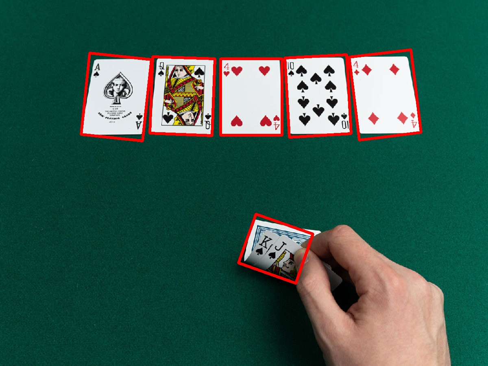
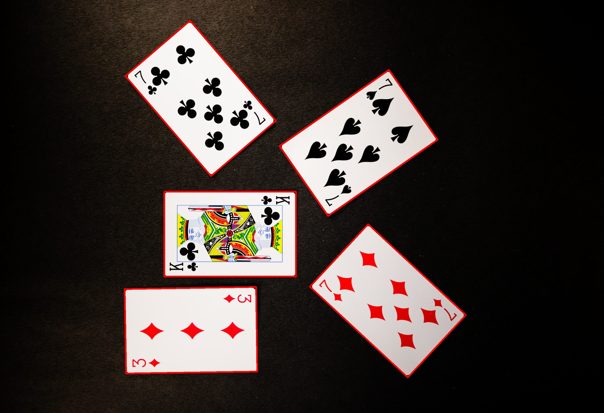

# Piece Picker: Zero-Shot Detection for Tiny Objects

Welcome to the Piece Picker project! This repository contains the implementation of a zero-shot detection algorithm (using Meta's [SAM2](https://github.com/facebookresearch/sam2)) specifically designed for tiny objects.

## Overview

Tiny object detection is a challenging task due to 
- The small size and limited features of the objects. 
- Usually multiple (5+) objects found in an image. 
- SOTA object detection models need a lot of images (usually unavailable during a quick POC) with the tiny objects for training. 
- Sometimes we are interested in the orientation of the objects as well.

This project address all the above points. We use a "grid of prompts" on the input image so that there is a very low chance to miss any object. We require no training images, thanks to SAM2's awesome zero-shot learning capabilities. The current implementation uses rotated bounding boxes to capture the orientation of the objects.


## Installation

1) The first step is to install SAM2 - instructions found [here](https://github.com/facebookresearch/sam2/tree/main?tab=readme-ov-file#installation).

2) Download the SAM2 model checkpoint from [here](https://dl.fbaipublicfiles.com/segment_anything_2/092824/sam2.1_hiera_tiny.pt). The "tiny" model should be fine. Place the downloaded model to the `checkpoint` folder of this project.

3) Download the contents of the config folder from [here](https://github.com/facebookresearch/sam2/tree/main/sam2/configs). Place the contents in the `configs` folder of this project.

4) Clone this repository:
    ```bash
    git clone https://github.com/ahore2/piece-picker.git
    ```

5) To install the rest of the necessary dependencies, run the following command:

    ```bash
    pip install -r requirements.txt
    ```

## Usage

To use the Piece Picker for detecting tiny objects, follow these steps:

1. Navigate to the project directory:
    ```bash
    cd piece_picker
    ```
2. Run the detection script:
    ```bash
    python main.py --image your_image.jpg --is_save_inference True
    ```
3. The output image will be generated in the `inference` directory.

## Example

Some test images are already provided in the directory `test_images`. Use the following command to test the code:

```bash
python main.py --image test_images/test1.jpg --is_save_inference True
```

The following is are the outputs for the three test images:






## Citation

```bibtex
@article{kirillov2023segment,
  title={Segment Anything},
  author={Kirillov, Alexander and Mintun, Eric and Ravi, Nikhila and Mao, Hanzi and Rolland, Alexander and Gustafson, Laura and Xiao, Tsung-Yi and Whitehead, Spencer and Berg, Alexander C and Lo, Wan-Yen and Doll{\'a}r, Piotr and Girshick, Ross},
  journal={arXiv preprint arXiv:2304.02643},
  year={2023}
}
```
